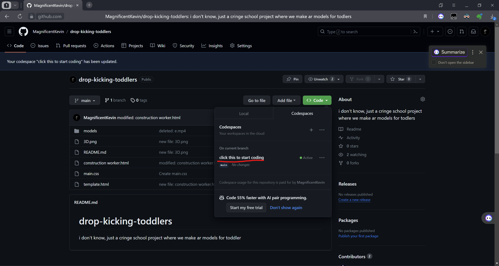

# drop-kicking-toddlers
i don't know, just a cringe school project where we make ar models for toddler

for my fellow cringe classmates, ill teach you how to use github:

thats all you need to know :) (the rest is overcomlicated and i bet you could figur out yourself, im talking to you, andy...)

to run the file, press ctrl+` in vscode (both web and app will work) and chose the TERMINAL tab. run this install command once:

npm i -g http-server

this will install a thingy, and after you installed it, run:

http-server

the port tab should have a "1" symbol next to it and a message should pop up.
click on the message's "open in browser" button and it will open a new tab in your default browser
now save your code and refreash the page.